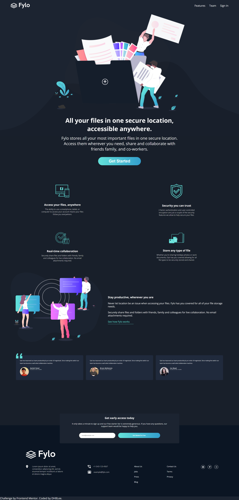
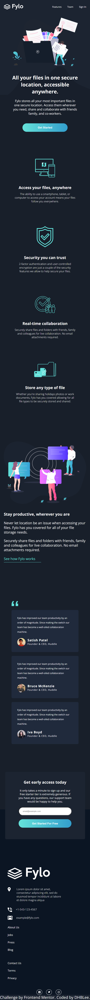

# Frontend Mentor - Fylo dark theme landing page solution

This is a solution to the [Fylo dark theme landing page challenge on Frontend Mentor](https://www.frontendmentor.io/challenges/fylo-dark-theme-landing-page-5ca5f2d21e82137ec91a50fd). Frontend Mentor challenges help you improve your coding skills by building realistic projects. 

## Table of contents

- [Overview](#overview)
  - [The challenge](#the-challenge)
  - [Screenshot](#screenshot)
  - [Links](#links)
- [My process](#my-process)
  - [Built with](#built-with)
  - [What I learned](#what-i-learned)
  - [Continued development](#continued-development)
  - [Useful resources](#useful-resources)
- [Author](#author)

## Overview

-A website that visuualy works only 375px and 1440px becasue of absolute positioning in some divs.

### The challenge

Users should be able to:

- View the optimal layout for the site depending on their device's screen size
- See hover states for all interactive elements on the page

### Screenshot

### Links

- Solution URL: [Add solution URL here](https://github.com/DHBLee/DHBLee-/tree/DHBLee/Fronend-Mentor/Fylo)
- Live Site URL: [Add live site URL here](https://dhb-lee-uvle.vercel.app/)

## My process

### Built with

- Semantic HTML5 markup
- CSS custom properties
- Flexbox
- CSS Grid
- JS

### What I learned

I learned to do a different approach when it comes to absolute 

### Continued development

Make my code more efficient adn scalable.

### Useful resources

- [Example resource 1](https://www.github.com) - Of course.

## Author

- Frontend Mentor - [@DHBLee](https://www.frontendmentor.io/profile/DHBLee)

